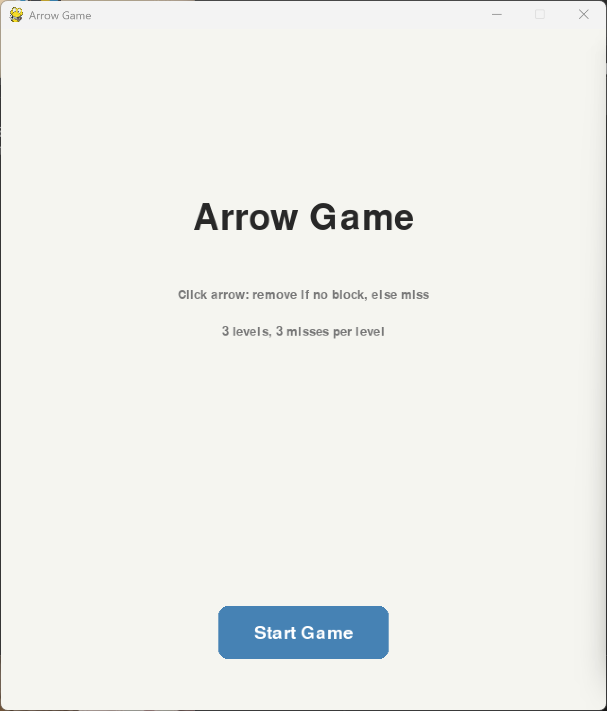
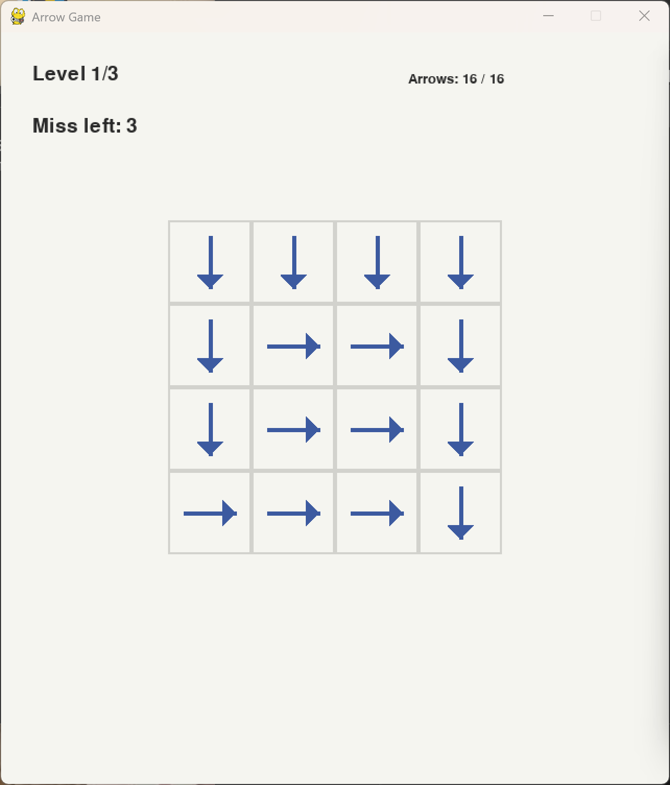
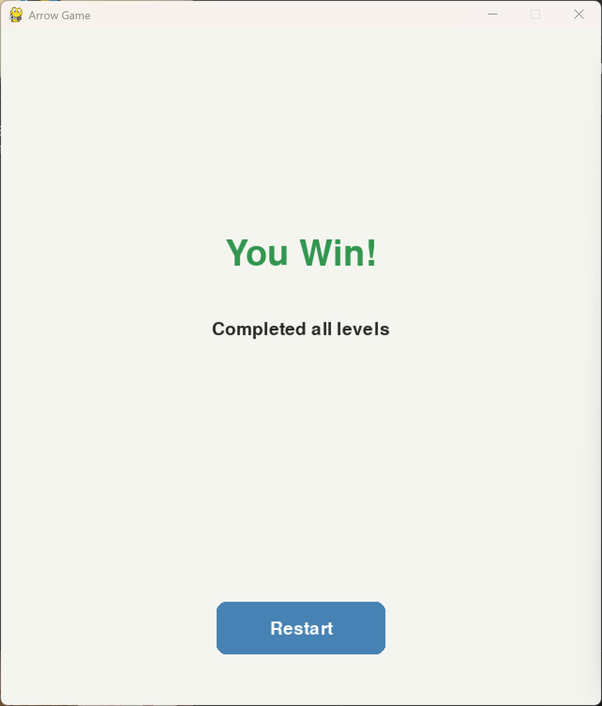

# arrow-game
软件工程作业，一箭又一箭小游戏，基于 Python Pygame 开发
# 一箭又一箭小游戏
## 项目简介
本项目是软件工程第二次个人作业，使用Python+Pygame实现箭头解谜小游戏。玩家点击箭头，当箭头前进方向无遮挡时箭头飞出消除；有阻挡则提示碰撞，消耗失误次数。包含3个可通关关卡，拥有开始界面、游戏界面、通关/失败界面。

## 开发环境
Python 3.11 + Pygame 2.6.1

## 安装与运行
1. 安装依赖：pip install pygame
2. 运行：python main.py

## 游戏操作说明
鼠标点击箭头进行操作
- 箭头前方无阻挡：箭头飞出并消除
- 箭头前方有箭头阻挡：无法消除，扣除1次失误机会
- 失误用完本关失败，可以点重新开始
清空全部箭头即可通关，自动进入下一关

## 游戏截图

